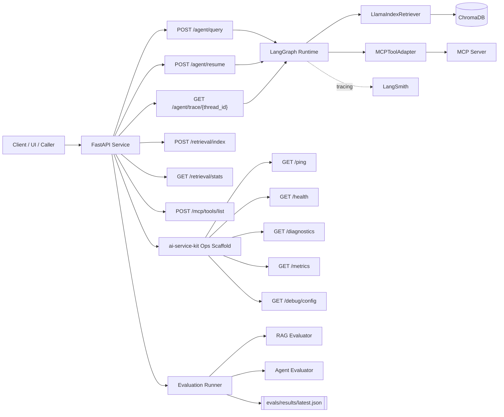

# agentic-ai-platform

`agentic-ai-platform` is a production-oriented reference implementation for portfolio and interview review, combining LangGraph orchestration, LlamaIndex retrieval, MCP-based tooling, LangSmith tracing, and repeatable evaluation loops on top of a hardened FastAPI + ai-service-kit operational foundation.

## Architecture



## Why LangGraph

- Typed state and explicit node boundaries make complex workflows safer under refactors.
- Native retry loops and conditional edges reduce brittle hand-rolled orchestration code.
- Built-in checkpointing and interrupt semantics support human review and operational recovery.
- Better operational fit than custom ReAct loops when statefulness, branching, and replayability matter.

## Why LlamaIndex

- Speeds up ingestion and retrieval iteration with document loaders, chunking, and retriever interfaces.
- Keeps retrieval code composable while still letting Chroma handle vector persistence.
- Provides faster iteration for document-heavy RAG systems than maintaining a raw Chroma-only abstraction layer.

## Why MCP

- Standardizes tool discovery and invocation contracts across independently developed capabilities.
- Reduces bespoke adapter drift when multiple teams contribute tooling.
- Improves interoperability between orchestration runtimes and tool providers.

For a deeper side-by-side decision framework, see `docs/FRAMEWORK_COMPARISON.md`.

## Eval Results

Source: `evals/results/latest.json` (generated at `2026-05-11T05:46:41.662314+00:00`).

### Aggregate

- Overall score: `0.25`
- Total cases: `15` (`5 factual`, `5 multi-hop`, `5 edge`)

### RAG Metrics

- faithfulness: `0.0`
- context_precision: `0.0`
- context_recall: `0.0`
- answer_relevancy: `0.0`
- RAG overall: `0.0`

### Agent Metrics

- task_completion_rate: `0.0`
- tool_call_accuracy: `1.0`
- cycle_efficiency: `0.0`
- hallucination_rate: `1.0`

### Interpretation

These are real computed values from the current runtime, not mocked scoreboard numbers. Treat them as a baseline that highlights current gaps in retrieval quality, answer grounding, and completion reliability before production rollout.

## What I’d Do Differently at 10x Scale

- Split control plane and runtime plane: isolate orchestration state/checkpoint services from request ingress.
- Move from in-memory checkpointing to durable external state store (for example Redis/Postgres) with retention policy.
- Add asynchronous ingestion pipeline and background index build workers.
- Introduce multi-tenant collections and per-tenant retrieval quotas.
- Add stronger evaluation gates in CI/CD: fail deploy when regression deltas exceed thresholds.
- Add distributed tracing/span correlation across FastAPI, graph nodes, MCP calls, and vector queries.
- Use managed secrets and workload identity instead of direct environment-secret injection.

## Related Repos

- `agents-api`: baseline custom ReAct-style orchestration used as a contrast for LangGraph decisions.
- `semantic-search-api`: raw Chroma-centric retrieval service used to compare against LlamaIndex abstraction.
- `rag-api`: RAG-focused service patterns that complement this platform’s evaluation and retrieval design.
- `ai-service-kit`: shared operational, provider, settings, and logging primitives used across all sibling services.

## Quick Start

1. Install dependencies.

```bash
pip install -r requirements.txt
```

2. Create environment config.

```bash
copy .env.example .env
```

3. Run API locally.

```bash
uvicorn app.main:app --host 0.0.0.0 --port 8000 --reload
```

4. Optional: run containers.

```bash
docker compose up --build
```

## Deployment (Railway Free Tier)

This repo includes `deployment/railway.toml` and a production `Dockerfile`.

1. Push to GitHub.
2. Create a Railway project from the repo.
3. Configure environment variables (`APP_ENV`, provider keys, `LANGCHAIN_PROJECT`, tracing flags).
4. Deploy and verify `/health` and `/agent/query`.

## API Endpoint Reference

### Operational

- `GET /ping`
- `GET /health`
- `GET /diagnostics`
- `GET /metrics`
- `GET /debug/config`

### Agent

- `POST /agent/query`
  - body: `query`, optional `thread_id`, optional `max_iterations`
  - query param: `stream=true|false`
  - returns: answer, sources, tool call trace, iteration count, LangSmith trace URL (when configured)

- `POST /agent/resume`
  - body: `thread_id`, `human_decision` (`approve|reject|modify`), optional `modified_answer`
  - resumes interrupted HITL execution

- `GET /agent/trace/{thread_id}`
  - returns persisted graph state snapshot for debugging

### Retrieval

- `POST /retrieval/index`
  - body: list of `{content, metadata, id?}` documents
  - indexes into LlamaIndex + Chroma

- `GET /retrieval/stats`
  - returns collection/document/chunk/embedding stats

### MCP

- `POST /mcp/tools/list`
  - returns discovered MCP tools and their schemas
